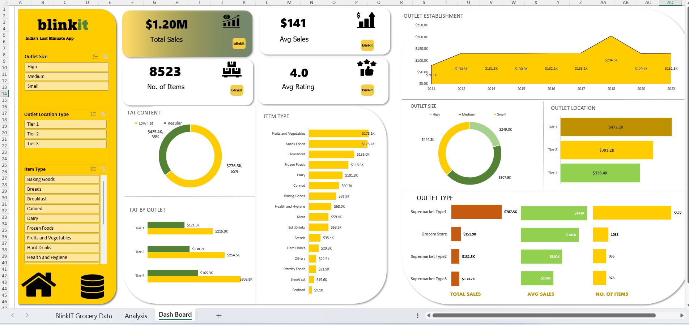

# BlinkIT Grocery Sales Analysis Dashboard 📊

## 📌 Project Overview

This project is an **Excel-based BlinkIT Grocery Sales Analysis Dashboard** created to analyze grocery sales data and convert raw data into meaningful business insights.

The project demonstrates how **Microsoft Excel** can be used for data cleaning, analysis, Pivot Tables, Pivot Charts, KPI calculations, and interactive dashboard creation.

> Note: BlinkIT is used as a case-study dataset for this project. The dashboard is created as an academic/practical Excel data analysis project.

---

## 🎯 Project Objective

The main objectives of this project are:

- Analyze overall grocery sales performance
- Calculate important Key Performance Indicators (KPIs)
- Analyze sales based on item type
- Analyze sales based on fat content
- Compare sales across outlet sizes
- Compare sales across outlet location types
- Analyze sales by outlet type
- Analyze sales according to outlet establishment year
- Create an interactive and easy-to-understand Excel dashboard

---

## 📂 Project Structure

The Excel workbook contains three main worksheets:

### 1. BlinkIT Grocery Data

This sheet contains the raw dataset used for the project.

The dataset includes information such as:

- Item Fat Content
- Item ID
- Item Type
- Outlet Establishment Year
- Outlet Identifier
- Outlet Location Type
- Outlet Size
- Outlet Type
- Item Visibility
- Item Weight
- Sales
- Rating

### 2. Analysis

The Analysis sheet contains:

- KPI calculations
- Pivot Tables
- Pivot Charts
- Sales analysis by Fat Content
- Sales analysis by Item Type
- Fat Content by Outlet
- Sales by Outlet Establishment Year
- Sales by Outlet Size
- Sales by Outlet Location
- Sales by Outlet Type
- Average Sales by Outlet Type
- Number of records by Outlet Type

### 3. Dashboard

The final dashboard provides a visual summary of the analysis.

It includes the following KPIs:

- **Total Sales:** $1.20M
- **Average Sales:** $141
- **Number of Items:** 8,523
- **Average Rating:** 4.0

The dashboard also contains visualizations for:

- Fat Content
- Item Type
- Outlet Establishment
- Outlet Size
- Outlet Location
- Outlet Type

Interactive filters are provided for:

- Outlet Size
- Outlet Location Type
- Item Type

---

## 📊 Key Analysis

### Sales by Fat Content

- Low Fat: approximately **$776.3K**
- Regular: approximately **$425.4K**

### Sales by Outlet Size

- High: approximately **$249.0K**
- Medium: approximately **$507.9K**
- Small: approximately **$444.8K**

### Sales by Outlet Location

- Tier 1: approximately **$336.4K**
- Tier 2: approximately **$393.2K**
- Tier 3: approximately **$472.1K**

### Sales by Outlet Type

- Supermarket Type 1: approximately **$787.5K**
- Grocery Store: approximately **$151.9K**
- Supermarket Type 2: approximately **$131.5K**
- Supermarket Type 3: approximately **$130.7K**

---

## 🛠️ Tools & Technologies

- Microsoft Excel
- Pivot Tables
- Pivot Charts
- Excel Formulas
- KPI Analysis
- Interactive Filters
- Data Visualization

---

## 📈 Dashboard Preview

The dashboard provides a visual overview of the grocery sales data and allows users to filter the analysis based on different outlet and item characteristics.

---

## 💡 Key Learning

Through this project, I learned how to:

- Work with a large dataset in Excel
- Create and analyze Pivot Tables
- Create Pivot Charts
- Calculate and present KPIs
- Build an interactive Excel dashboard
- Convert raw data into meaningful visual information
- Present data analysis in a business-friendly format

---

Skills demonstrated:
- Microsoft Excel
- Data Analysis
- Pivot Tables
- Data Visualization
- Dashboard Development
